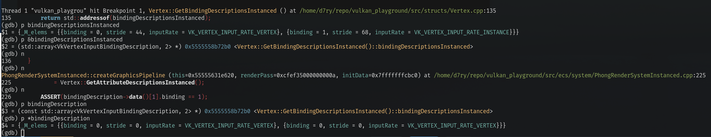

# Little Vulkan App

It's like writing an OS

## Stuff Done

- [x] graphics pipeline abstractions
- [x] basic game entity abstractions
- [x] object viewer window

## TODO

- [ ] global instancing -- instance everything

# Rant

## Strange Memory Issue??????

just had the strangest memory bug i've ever experienced.

```cpp
const std::array<VkVertexInputBindingDescription, 2>* Vertex::
    GetBindingDescriptionsInstanced() {
    static std::array<VkVertexInputBindingDescription, 2> bindingDescriptionsInstanced;

    static bool initialized = false;
    if (!initialized) {
        // bind point 0: just use the non-instanced counterpart
        bindingDescriptionsInstanced[0] = GetBindingDescription();

        // bind point 1: instanced data
        bindingDescriptionsInstanced[1].binding = 1;
        bindingDescriptionsInstanced[1].stride = sizeof(VertexInstancedData);
        bindingDescriptionsInstanced[1].inputRate = VK_VERTEX_INPUT_RATE_INSTANCE;

        initialized = true;
    }

    return std::addressof(bindingDescriptionsInstanced);
}
```

the above function returns an address to a stack-allocated static variable

All the values are correct initialized and written into. 
However as soon as the function returns, the variable gets re-initialized into its original values.



Same bug happened to my TextureManager singleton, where the stack-allocated singleton seems to have
gotten zero-initialized.
