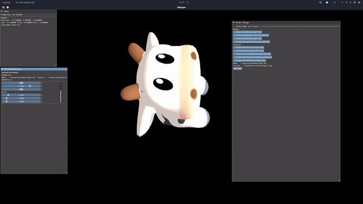

# Little Vulkan App

## Stuff Done

### Runtime Object Instancing

Not sure if this is the best approach but it's the best I could currently pull off. Object of unique meshes and textures are grouped together, using the same UBO and indexed dynamic UBOs that dynamically resizes as new objects are added.

## Work area

### Basic stuff

- [ ] shadow mapping
- [ ] cube mapping
- [ ] skybox
- [ ] PBR
- [ ] light instancing

### Architecture

- [ ] scene hierarchy

### Geometry

- [ ] skinned mesh
- [ ] displacement mapping
- [ ] virtual geometry(need to review graph theory)

### Rendering

- [ ] a separate pathtracer
- [ ] deferred shading(multi-pass like gta5 for transparent stuff)(or clustered forward?)
- [ ] RTX

### Simulation

- [ ] physics engine integration
- [ ] custom physics engine using compute shader
